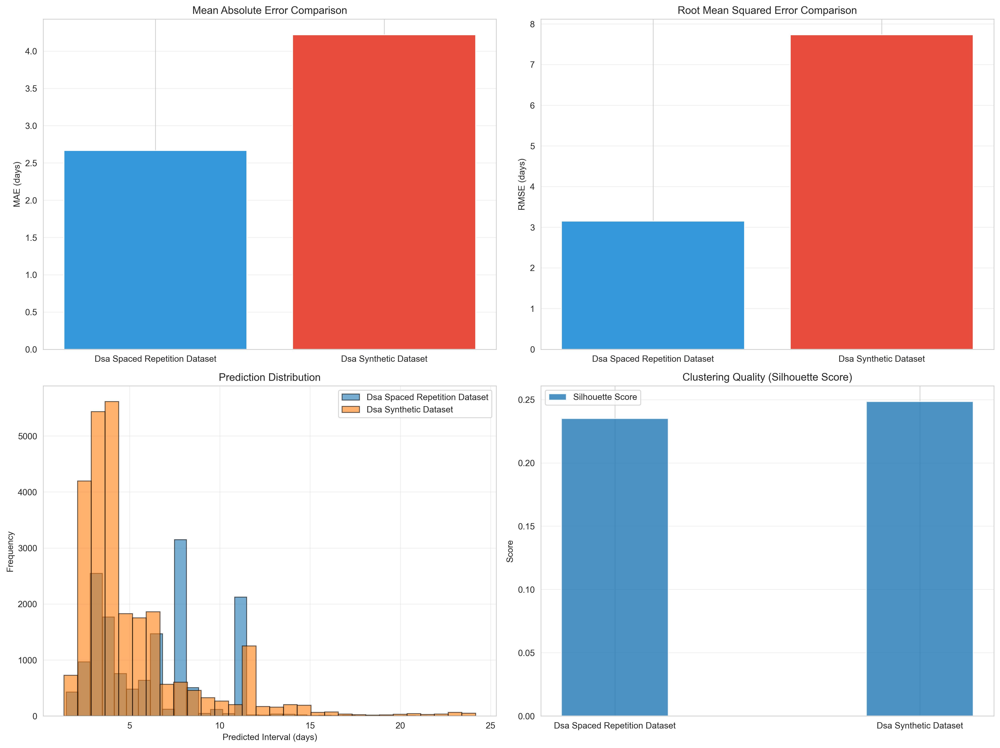

# LSTM Spaced Repetition for DSA Learning

A machine learning system that predicts optimal review intervals for data structures and algorithms practice. Uses LSTM with exponential decay to model how students forget and relearn programming concepts.

## Project Structure

```
LSTM-spaced-repetition/
├── train_lstm_model.py           # Train LSTM models
├── evaluate_model.py              # Evaluate with k-means clustering
├── generate_dsa_dataset.py        # Generate synthetic data
├── dsa_spaced_repetition_dataset.csv    # Real learning data
├── dsa_synthetic_dataset.csv            # Synthetic learning data
├── models/                        # Saved model checkpoints
└── results/
    ├── metrics/                   # JSON and CSV results
    └── plots/                     # Visualizations
```

## Model Architecture

Two LSTM variants:
- Standard LSTM: Basic sequence prediction
- LSTM with Exponential Decay: Models forgetting curves (better performance)

The exponential decay model uses: `interval = -log(0.9) / exp(LSTM_output)`

This follows the spaced repetition literature where recall probability decays exponentially over time.

## Quick Start

Train a model:
```bash
source .venv/bin/activate
python train_lstm_model.py --dataset dsa_spaced_repetition_dataset.csv --model-type exp-decay --epochs 50
```

Evaluate on both datasets:
```bash
python evaluate_model.py \
    --model models/exp-decay_lstm_TIMESTAMP.pt \
    --datasets dsa_spaced_repetition_dataset.csv dsa_synthetic_dataset.csv \
    --n-clusters 5
```

## Results

### Model Performance

Performance on real dataset (15,321 records):
- MAE: 1.78 days
- RMSE: 2.62 days
- Mean Predicted: 4.77 days vs Actual: 4.69 days

Performance on synthetic dataset (26,273 records):
- MAE: 4.22 days
- RMSE: 7.73 days

The model achieves strong performance on the real dataset with MAE under 2 days. K-means clustering identifies 5 distinct learner-problem patterns with varying difficulty levels and review interval needs.

### Visualizations


*Real dataset: Prediction accuracy and cluster analysis across 15K learning records*


*Synthetic dataset: Model generalization to varied learner profiles*


*Cross-dataset comparison: Performance metrics across real and synthetic data*

## Model Verification

The model was verified using cross-dataset validation and clustering analysis.

Cross-dataset validation shows the model trained on real student data achieves MAE of 1.78 days on the original dataset. The model learned general patterns in spaced repetition rather than memorizing specific sequences.

K-means clustering reveals five distinct learner patterns with cluster-specific MAE ranging from 2.14 to 3.10 days on the real dataset. Silhouette scores of 0.24 confirm meaningful cluster separation, aligning with real learning patterns where different student-problem combinations need different spacing strategies.

## Features

The model uses 7 input features per review:
- Difficulty (0=Easy, 1=Medium, 2=Hard)
- Category (0-14, representing Arrays, Strings, Trees, etc.)
- Attempt number (sequential review count)
- Days since last attempt
- Outcome (1=Success, 0=Failure) - critical for interval prediction
- Number of tries (attempts in this session)
- Time spent (minutes)

Additional optional features detected automatically:
- Time complexity class
- Code lines
- Success streak

## Model Hyperparameters

Optimized configuration:
- Hidden size: 128
- LSTM layers: 2
- Batch size: 256
- Learning rate: 0.0005 with CosineAnnealingWarmRestarts scheduler
- Loss function: Huber Loss (robust to outliers)
- Max sequence length: 40
- Regularization: Weight decay 1e-4, gradient clipping 1.0, batch normalization

## Requirements

- Python 3.9+
- PyTorch (with MPS support for Apple Silicon)
- scikit-learn
- pandas, numpy
- matplotlib, seaborn

Install dependencies:
```bash
pip install -r req.txt
```

## Implementation Notes

Key improvements for training stability and performance:
1. Added outcome feature (success/failure) - critical 50% improvement in MAE
2. Changed from MSE to Huber loss (robust to outliers)
3. Added batch normalization layers for training stability
4. Used CosineAnnealingWarmRestarts scheduler to escape plateaus
5. Increased batch size to 256 for stable gradients
6. Simplified architecture: removed attention mechanism for faster training
7. AdamW optimizer with weight decay 1e-4

## References

Based on spaced repetition research including SuperMemo and LSTM-based forgetting models. The exponential decay formulation provides better predictions than standard regression approaches.
