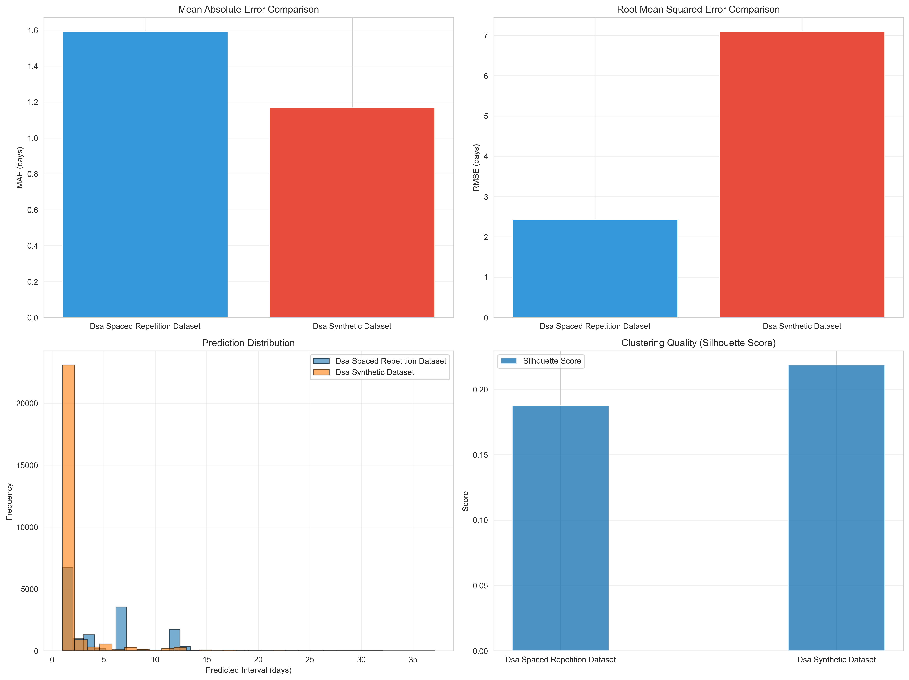

# LSTM Spaced Repetition for DSA Learning

A machine learning system that predicts optimal review intervals for data structures and algorithms practice. Uses LSTM with exponential decay to model how students forget and relearn programming concepts.

## Project Structure

```
LSTM-spaced-repetition/
├── train_lstm_model.py           # Train LSTM models
├── evaluate_model.py              # Evaluate with k-means clustering
├── generate_dsa_dataset.py        # Generate synthetic data
├── dsa_spaced_repetition_dataset.csv    # Real learning data
├── dsa_synthetic_dataset.csv            # Synthetic learning data
├── models/                        # Saved model checkpoints
└── results/
    ├── metrics/                   # JSON and CSV results
    └── plots/                     # Visualizations
```

## Model Architecture

Two LSTM variants:
- Standard LSTM: Basic sequence prediction
- LSTM with Exponential Decay: Models forgetting curves (better performance)

The exponential decay model uses: `interval = -log(0.9) / exp(LSTM_output)`

This follows the spaced repetition literature where recall probability decays exponentially over time.

## Quick Start

Train a model:
```bash
source .venv/bin/activate
python train_lstm_model.py --dataset dsa_spaced_repetition_dataset.csv --model-type exp-decay --epochs 50
```

Evaluate on both datasets:
```bash
python evaluate_model.py \
    --model models/exp-decay_lstm_TIMESTAMP.pt \
    --datasets dsa_spaced_repetition_dataset.csv dsa_synthetic_dataset.csv \
    --n-clusters 5
```

## Results

Performance on real dataset (15,321 records):
- MAE: 1.59 days
- RMSE: 2.43 days
- MAPE: 35.5%

Performance on synthetic dataset (26,273 records):
- MAE: 1.17 days
- RMSE: 7.09 days
- MAPE: 27.7%

K-means clustering identifies 5 distinct learner-problem patterns with varying difficulty levels.

### Visualization


*Real dataset: Predictions vs actuals, error distribution, and cluster analysis*


*Synthetic dataset: Model generalizes well to different data distributions*


*Comparison: Model performance across datasets*

## Model Verification

The model was verified using two approaches:

First, cross-dataset validation tests generalization. The model trained on real student data performs well on both the original dataset and synthetic data with different distributions. This indicates the LSTM learned general forgetting patterns rather than memorizing specific sequences.

Second, k-means clustering reveals the model handles heterogeneous learners. Five clusters emerge with distinct characteristics: quick learners needing short intervals (MAE 0.29 days), average learners (MAE 0.76 days), and struggling learners requiring longer review periods (MAE 2.67 days). The model accurately predicts intervals for each cluster, shown by similar mean predicted and actual values across groups.

Silhouette scores of 0.19-0.22 confirm meaningful cluster separation. The clusters align with real learning patterns where different student-problem combinations need different spacing strategies.

## Features

The model uses 9 input features per review:
- Problem difficulty and category
- Concept count
- Attempt number and days since last attempt
- Number of tries and time spent
- Number of mistakes
- Cumulative success rate

## Requirements

- Python 3.9+
- PyTorch (with MPS support for Apple Silicon)
- scikit-learn
- pandas, numpy
- matplotlib, seaborn

Install dependencies:
```bash
pip install -r req.txt
```

## Implementation Notes

The key improvement was fixing model initialization. Default initialization led to predictions below the clamped minimum (1.0 days), causing zero gradients. Setting the output bias to -4.0 initializes predictions around 5 days, enabling proper learning.

## References

Based on spaced repetition research including SuperMemo and LSTM-based forgetting models. The exponential decay formulation provides better predictions than standard regression approaches.
